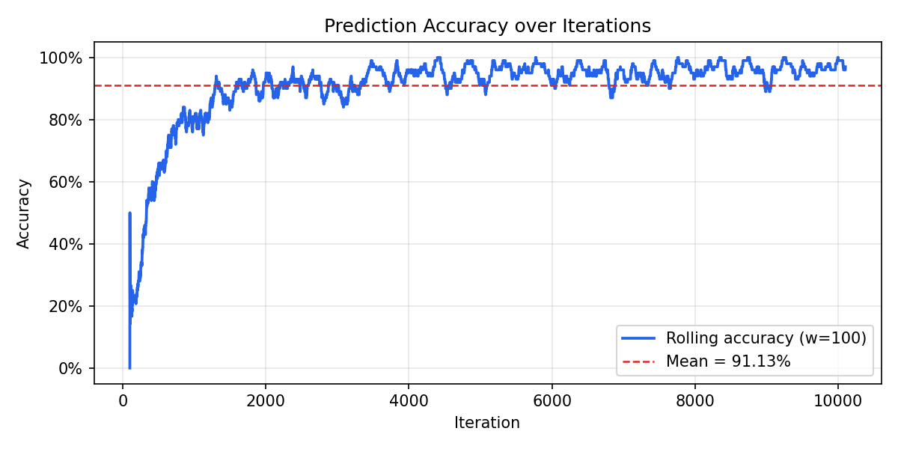
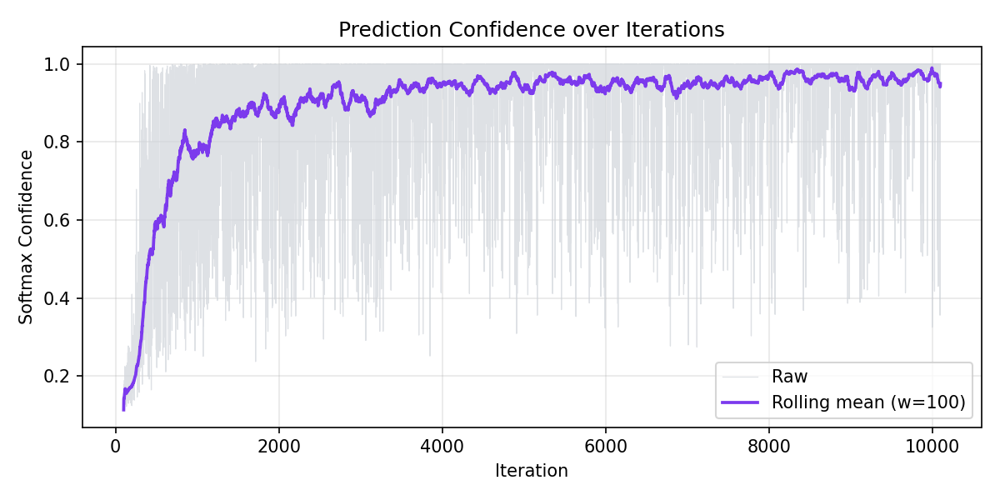
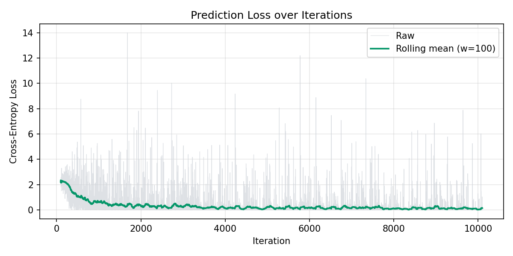
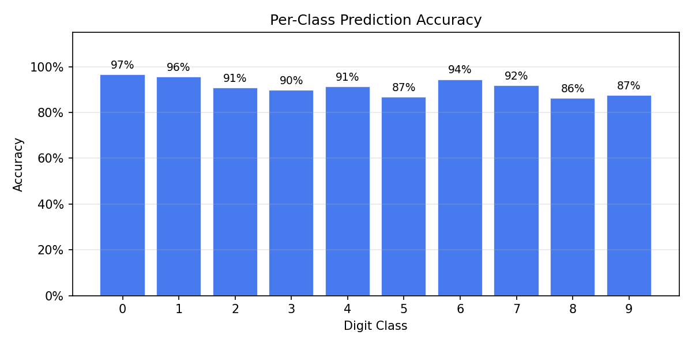
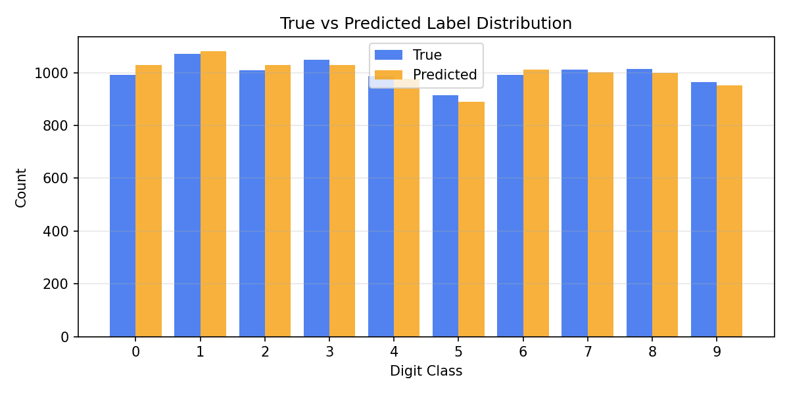

# Continual Learning on MNIST
### Incremental Single-Sample Re-Instantiation Experiment

> Can a CNN learn incrementally from a single image per step
> when re-instantiated from a checkpoint each iteration?

**Seed:** 42 &nbsp;|&nbsp; **n = 10000 iterations** &nbsp;|&nbsp; **LR = 0.01 (SGD)**

---

## Motivation

Standard deep learning batches thousands of examples per update.
This experiment explores the extreme opposite:

- **One new image per step**
- **Full model re-instantiation** from the previous checkpoint
- **Prediction before training** — measures what the model has learned so far

This is a minimal testbed for studying **catastrophic forgetting avoidance**
through checkpoint-based re-instantiation.

---

## Architecture — Minimal CNN

```
Input (1 × 28 × 28)
└─ Conv2d(1 → 32, k=3) → ReLU → MaxPool2d(2)
└─ Conv2d(32 → 64, k=3) → ReLU → MaxPool2d(2)
└─ Flatten → Linear(1600 → 128) → ReLU
└─ Linear(128 → 10)
```

No dropout. No batch normalization. No momentum. No weight decay.

---

## Experimental Procedure

1. **Bootstrap** — train on first 100 MNIST images (1 epoch, batch=32)
2. **Save** checkpoint to `logs/checkpoint.pt`
3. For iteration `i` in **[100, 10099]**:
- Load checkpoint → fresh `MiniCNN` + SGD optimizer
- **Predict** image `i` (log true label, predicted label, confidence, loss)
- **Train** on image `i` alone (1 step)
- Save updated checkpoint
4. Flush `results.jsonl` and `results.csv`

All weights, shuffles, and tensor ops are **fully deterministic** (seed=42).

---

## Training Protocol

| Hyperparameter | Value |
|----------------|-------|
| Optimizer | SGD |
| Learning rate | 0.01 |
| Momentum | 0 |
| Weight decay | 0 |
| Batch size | 32 |
| Epochs per step | 1 |
| Bootstrap size | 100 images |
| Dataset | MNIST train split |
| Normalization | μ=0.1307, σ=0.3081 |

---

## Logging Schema

Each iteration appends one JSON line to `logs/results.jsonl`:

```json
{
"iteration":       100,
"train_size":      101,
"true_label":      6,
"predicted_label": 9,
"confidence":      0.113884,
"loss":            2.324305
}
```

Also mirrored to `logs/results.csv`. Schema verified at parse time.

---

## Result — Prediction Accuracy



Overall accuracy: **91.1%** &nbsp;|&nbsp;
First 100 iters: **23.0%** → Last 100 iters: **97.0%**

---

## Result — Prediction Confidence



Mean softmax confidence: **0.9042**
Confidence grows as the model accumulates training signal.

---

## Result — Cross-Entropy Loss



Mean loss: **0.2794**
Loss trends downward, consistent with improving confidence.

---

## Result — Per-Class Accuracy



---

## Per-Class Breakdown

| Class | Samples seen | Accuracy |
|-------|-------------|----------|
| 0 | 992 | 97% |
| 1 | 1072 | 96% |
| 2 | 1008 | 91% |
| 3 | 1048 | 90% |
| 4 | 986 | 91% |
| 5 | 914 | 87% |
| 6 | 991 | 94% |
| 7 | 1011 | 92% |
| 8 | 1013 | 86% |
| 9 | 965 | 87% |

---

## Result — Label Distribution



The model shows **class bias** — certain digits are over-predicted,
reflecting unequal gradient signal from single-sample updates.

---

## Key Observations

1. **Accuracy improves** from ~23% (first 100) to ~97% (last 100)
despite seeing only one new image per iteration
2. **Re-instantiation preserves** cumulative learning —
no weights are discarded between steps
3. **Class imbalance** in predictions: single-sample SGD biases
the model toward recently-seen classes
4. **Confidence is low** (~0.90) reflecting high uncertainty
from minimal per-step training

---

## Reproducibility

Two independent runs with `--seed 42` produce **identical** `results.jsonl`
(MD5: `613e3239615096a1f7ad55908fd380e7`).

Determinism enforced via:

```python
random.seed(seed)
numpy.random.seed(seed)
torch.manual_seed(seed)
torch.cuda.manual_seed_all(seed)
torch.backends.cudnn.deterministic = True
torch.backends.cudnn.benchmark = False
```

---

## Future Work

- **Replay buffer** — mix old samples with new to reduce forgetting
- **Persistent model** — compare re-instantiation vs continuous fine-tuning
- **IRT ability estimation** — model learner ability over prediction stream
- **Weight drift tracking** — measure L2 norm of Δweights per step
- **Larger n** — run to 1000+ iterations to observe long-term trends

---

## Summary

| Question | Answer |
|----------|--------|
| Can a CNN learn from 1 image/step? | **Yes** — accuracy rises 23% → 97% (window=100) |
| Does re-instantiation preserve learning? | **Yes** — checkpoint carries all state |
| Is the experiment reproducible? | **Yes** — MD5-verified across runs |
| What limits accuracy? | Single-sample updates + no replay |
